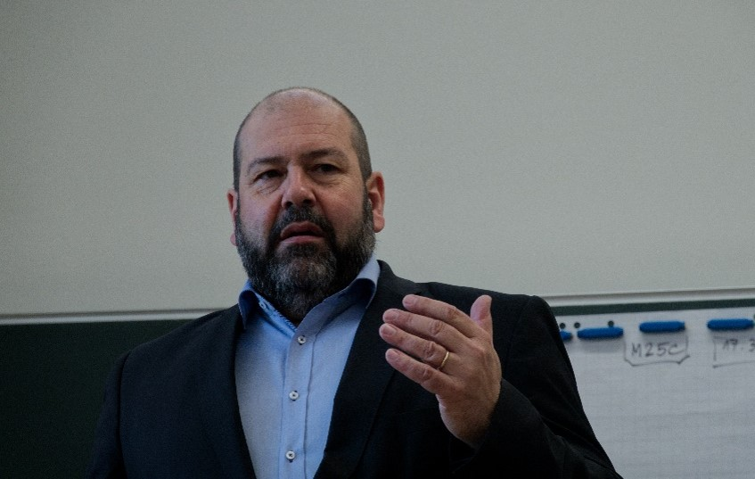
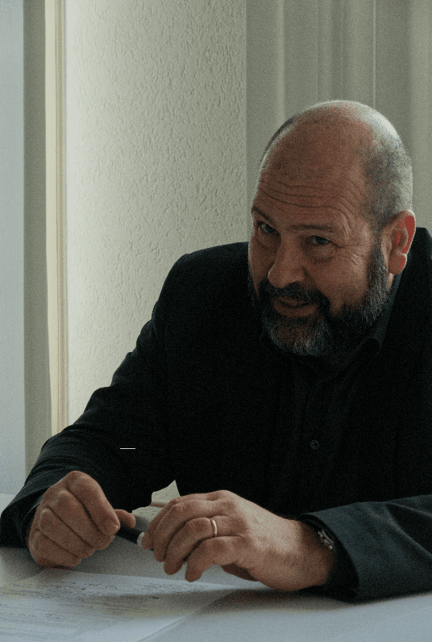

+++
title = "Volles Programm, Vollgas und dann Hängematte : André Lorenzetti"
date = "2023-05-26"
draft = false
pinned = false
image = "bild1-1-1-1-1-1-1-.png"
+++



Jeder kennt den Rektor unseres Schulhauses, jeder sieht ihn ab und zu durch die Gänge laufen und grüsst ihn freundlich. Aber wer ist der Mann eigentlich, der die Geschicke unsere Schule leitet? Ein Reporter*innenteam hat André Lorenzetti durch einen Arbeitstag begleitet.



Es ist 5.45 Uhr in Oberdiessbach, als André Lorenzettis Wecker klingelt. Da Rektor des Gymnasiums Kirchenfeld etwas abgelegen von Bern wohnt, hat er einen ziemlich langen Arbeitsweg. Damit der Sport nicht zu kurz kommt, fährt er 45 min mit seinem äusserst eleganten Liegevelo zum Gymnasium Kirchenfeld. Lorenzetti ist jeweils einer der ersten, die im Schulhaus sind. Als er im Büro ankommt, liegt bereits ein Berg Pendenzen vor ihm, den er heute abarbeiten sollte. Der Rektor hat aber nur begrenzt Zeit, denn seine Assistentin hat bereits viele Termine für den Tag geplant. Um in eine gute Arbeitsstimmung zu kommen, spielt Lorenzetti gerne Musik ab. Er kann aber zum Arbeiten nur Musik hören, die er kennt und bei denen er nicht auf die Lyrics achtet. Zuerst ordnet Lorenzetti alle Pendenzen und erstellt dann einen Zeitplan, um die Lücken zwischen den Terminen effektiv nutzen zu können. Diesen Zeitplan inklusive Pausen hält er sehr genau ein, nach der einberechneten Zeit müssen die Pendenzen jeweils abgearbeitet sein. Er könnte, wie wohl alle Menschen, die Dinge noch besser machen, aber die Zeit, die ihm zur Verfügung steht, bestimmt die Qualität seiner Arbeit.

Als die Schulglocken erstmals läuten, beginnt die Rektoratssitzung (mit der Assistentin der Schulleitung Alicia Salas und seiner persönlichen Assistentin Jacqueline Weber). Die Sitzung dient dem Austausch und Klären von eventuellen Fragen. «Wir befürchten stets, in der Aufgaben- und Terminflut etwas zu verpassen», meint Lorenzetti. Deshalb würde sich die Schulleitung stets um ein gutes Pendenzen- und Projektmanagement bemühen. Der Rektor ist viel beschäftigt und gefragt, der Kalender ist dementsprechend eng getaktet und Freiraum muss effizient genutzt werden. Ein Traktandum dieser Sitzung ist die Lohnmaschine, die Fehler in der Lohnauszahlung aufzeigt, die jemand beheben muss. Zudem muss er sich dringend mit einem disziplinarischen Fall auseinandersetzen. Es ist ihm daher wichtig, dass das reguläre Tagesgeschäft auch ohne ihn glatt läuft, damit ihm ausreichend Zeit für die Sonderfälle bleibt. Dafür bedarf es den wöchentlichen Rektoratssitzungen.

Als nächstes geht es zu einem Klassenbesuch, dessen Ziel es ist, den Austausch zwischen Rektor und Schüler\*innen zu pflegen und die Gymnasiast\*innen, beziehungsweise Lorenzetti zu erleben. Heute steht eine MN-Klasse an. Gerade erklärt Lorenzetti den Schüler\*innen seine Aufgaben als Rektor, was ihn momentan beschäftigt – «das Platzproblem und die Mensanachfolge stellen gerade die grössten Herausforderungen dar» – und wie er plant, die Probleme anzupacken. Von Störungen wie Schüler\*innen, die zu spät in den Unterricht schleichen, lässt sich Lorenzetti nicht ablenken, sondern reagiert nur mit einem kurzen «Guätä Morgä» und fährt seine Rede unbeirrt weiter. Nach der abschliessenden Fragerunde bei der der Rektor gerne Rückmeldungen über sein Tun und Lassen entgegennimmt, gibt es eine kurze Verschnaufpause.

Morgen steht wieder ein Klassenbesuch an und dann noch einer, bis Lorenzetti alle sechzig Klassen des Gymnasiums besucht hat - ganz schön viele. Die Klassenbesuche gehören zu Lorenzettis Tagesordnung, er legt sehr viel Wert auf diese. Sie sind für André Lorenzetti eine echte Herzensangelegenheit, denn die «Schüler*innen sind mir noch ein bisschen wichtiger als die Lehrpersonen». Ein weiterer Vorteil dieser Klassenbesuche ist, dass Lo-renzetti so aus seinem Büro rauskommt und anderen Leuten begegnet. Etwas, das er an seinem Beruf enorm schätzt und was für ihn einfach dazugehört. Oft ist es sogar so, dass der Stapel auf seinem Schreibtisch am Ende des Tages nicht vollständig abgearbeitet ist, da der Rektor den ganzen Tag unterwegs ist und fast nie an seinem Schreibtisch sitzt. Der Tag hat einfach zu wenig Stunden für Lorenzetti.
Zum Mittagessen wird eine grosse Portion des Tages-Menus in der Mensa bestellt. Soll es mal etwas anderes sein, macht Lorenzetti einen kurzen Abstecher in die Migros an der Luisenstrasse. «Bei so einem Teriyaki-Sandwich läuft einem schon das Wasser im Mund zusammen», meint er. Gegessen wird seit Corona aber meistens im Rektoratszimmer.

Frisch gestärkt geht es zum Workshop «Umgang mit Belastungen», welchen er im Rahmen des Gesundheitstags des Gymnasiums leitet. In ebendiesem Workshop erklärt Lorenzetti, wie er mit Belastungsspitzen umgeht und gibt den Schüler\*innen Tipps & Tricks für ihr eigenes Leben mit auf den Weg. Nach einer kurzen Vorstellungsrunde werden die Teilnehmenden schon fast immer mit dem richtigen Namen angesprochen. Das Ansprechen mit korrektem Vornamen ist Lorenzetti wichtig, denn er möchte den Schüler\*innen zu verstehen geben, dass er sie ernst nimmt und an persönlichem Kontakt interessiert ist. Nach einem Input von Lorenzetti sollen die Schüler\*innen das Gelernte auf fiktive Situationen wie auch auf Situationen des Rektors – die Mensanachfolge, schon wieder – selbst anwenden. Lorenzetti hält sich auch hier strikt an seinen Zeitplan und als doch mal fünf Minuten überzogen werden, motzt er augenzwinkernd, weil die Schüler\*innen ihn nicht darauf hingewiesen haben. Zum Schluss gibt es eine Take-Home-Message-Runde und Lorenzetti fragt nach Rückmeldungen zu seinem Workshop, damit er diesen fürs nächste Mal verbessern kann. Seine persönliche Take-Home-Message an die Schüler*innen ist: «Die Qualität der Arbeit wird durch die zur Verfügung stehende Zeit bestimmt.» Nach dem Workshop kann er nun auch diesen Punkt von seiner To-Do-Liste abhaken, was beim Rektor ein Gefühl der Genugtuung auslöst.

Inzwischen ist für die meisten Schüler\*innen der Schultag zu Ende. Nicht so aber für Lorenzetti, jetzt steht nämlich noch eine Sitzung zur Nachfolgeregelung der Mensa an, die momentan wichtigste und dringendste Angelegenheit. Das Thema ist nicht ganz einfach, es darum geht, eine neue Mensabetreiberin zu finden, da die Von Oettinger AG auf Ende Schuljahr gekündigt hat. Es sind noch sehr viele Fragen offen und der Prozess der Findung noch am Anfang, während die Zeit unermüdlich vorwärtsschreitet. «Es wäre nicht gut, wenn die Schüler\*innen nach den Sommerferien am Morgen in der Mensa keine Schoggigipfeli bekämen», meint er. Dementsprechend konzentriert ist die Stimmung. Besonders bei Lorenzetti kommt das Gefühl auf, er wolle seine ausgesprochenen Wörter so effizient wie möglich nutzen. Was aber nicht heisst, dass Humor keinen Platz hat: Im Gegenteil, immer wieder ertönt Lorenzettis tiefes, volles Lachen, etwa nachdem er das Reportageteam als „rasende Reporter“ vorgestellt hat. Zudem fällt einem wie auch schon bei der Rektoratssitzung, dem Workshop und dem Klassenbesuch den Mix zwischen Standartsprache und Analogien und Bemerkungen auf Mundart auf. So hörten die Schüler während dem Klassenbesuch von ihm immer wieder: „Lorenzetti, sträng di a.“ Die Sitzung der Findungskommission für die Mensanachfolge ist eine rege Diskussion, jeder meldet sich zu Wort. Als Aussenstehende bekommt man das Gefühl, diese Sitzung ist das, was Lorenzetti unter „Austausch fördern“ versteht. Ihm ist wichtig, dass alle ihre Meinungen offen kommunizieren. Zweimal meint er dann aber doch, er wolle diese spezifische Diskussion abbrechen, es wirkt, als wären sie ihm zu banal. Ein Punkt ist für den Rektor aber sehr klar: Trotz der komplizierten Situation ist es ihm wichtig, dass alle Verfahren korrekt und genau wie vom Kanton vorgegeben ablaufen.

Nach einem ersten offenen Teil der Sitzung werden dann im zweiten Teil Kärtchen mit Muss- und Kann-Bedingungen für die neue Mensa geschrieben. Sein Blick nimmt immer wieder nachdenkliche Züge an, dieses Preis-Leistungs-Verhältnis sei schon ein Dilemma, raunt er seinem Sitznachbar zu. Als kaum einer Kann-Bedingungen aufschreibt, meint er, er brauche noch etwas mehr von denen Kärtchen, die es etwas mehr „Ghirnschmalz“ verlangen. Am Ende gibt es wie immer bei Lorenzetti eine Feedback-Runde und als ein Kärtchen von der Mehrheit kritisiert wird, zerreißt er es kurzerhand.

Als die letzten Schüler das Gebäude verlassen, geht ein anstrengender Tag auch für den Rektor zu Ende. Wird es Lorenzetti eigentlich nie zu viel? «Nein, und ich habe mein Frühwarnsystem kennengelernt. Wenn ich eine Woche lang jeden Morgen um fünf aufwache, dann ist etwas nicht mehr gut. » Das sei ihm aber schon lange nicht mehr passiert. Zudem findet er, er sei eigentlich nie gestresst, er habe nur manchmal sehr viel zu tun. Für Lorenzetti ist die Work-Life-Balance ein Quatsch: «Als ob man nicht leben würde, während man arbeitet. Das geht doch nicht, schon gar nicht in einer Schule!» Und auf die Frage, warum er denn nicht weniger arbeite, antwortet er: «Am Ende des Tages sind es die Menschen. Da sind ganz viele tolle Menschen hier in diesem Haus, für die es sich lohnt, sich zu engagieren.» Übers Jahr gesehen arbeite er trotz den Schulferien tatsächlich etwas zu viel. Er schiebt aber nach, er könne durchaus auch sehr gut nichts machen. Für ihn heisst das, in der Hängematte zu liegen und zu lesen.
Obwohl Lorenzetti den Job als Rektor liebt, gibt es natürlich auch Bereiche, die ihm weniger gut gefallen. Dazu gehören vor allem jegliche Arten von Trennungen, sei es von Schüler\*innen oder Lehrpersonen. Es helfe in solchen Momenten, den Schulleiter als Rolle zu betrachten, um unabhängiger entscheiden zu können. Deshalb falle es ihm vielleicht einfacher, auch unpopuläre Entscheidungen zu treffen. Sowieso sei es ihm egal, was andere von ihm denken, denn er handle nicht für seinen Ruf. Jeder und jede dürfe auch erzählen über ihn, was er oder sie will. Einzige Bedingung sei, dass das Gesagte stimmt.
Was ihm hingegen in seiner Funktion als Rektor sehr gut gefällt, ist die Vielseitigkeit der Aufgabenbereiche und die erforderliche Flexibilität. Er arbeitet einerseits oft mit Leuten im Schulhaus zusammen, mit Lehrpersonen, dem Personal und Schüler\*innen, andererseits vertritt er das Gymnasium gegen aussen und setzt sich anderenorts beispielsweise für bessere Platzbedingungen ein. So bringt jeder Tag auch etwas Neues mit sich. Das Schulleitungsteam plane die Tage zwar im Voraus, aber immer wieder klopfe es an der Türe und er müsse sich um etwas Unerwartetes kümmern, meint Lorenzetti.

Trotzdem, einen Ausgleich brauchen alle, die in der Woche auch mal 70 Stunden arbeiten. Dazu dient Lorenzetti einerseits die Musik: „Musik gibt mir mehr Energie, als sie mir nimmt.“ Man kann sagen, wo er ist, ist Musik. Er leitet einen eigenen Chor, unterrichtet ein bis zwei Klassen in Musik am Gymer und spielt Trompete in der Big Band des Gymnasiums. Und welche Musik gefällt ihm besonders? Bach, Jazz, Rock, Pop. „Ich hätte den Gymer nicht überstanden, wenn es die rote Platte von den Beatles nicht gegeben hätte.“ Heute hört er zum Arbeiten gerne Toto, speziell die Aufzeichnung des Livekonzerts in Paris im Jahr 2007.

Andererseits ist er auch sportlich sehr aktiv. Diesbezüglich sei der Lockdown sehr ungünstig gewesen, als alle Fitnesscenter geschlossen waren. Zu seinem Sportprogramm gehört seither, dass er Sommer und Winter, wenn es die Wetterverhältnisse und sein Stundenplan zulassen, mit seinem Liegevelo in die Schule fährt. Zudem ist er leidenschaftlicher Segler. Das Segeln auf dem Thunersee tue ihm sehr gut, denn es schaffe Distanz zu seinem Alltag.

Inzwischen ist es spät und Lorenzetti will nun nach Hause. Auch das gemeinsame Abendessen mit seiner Frau hat für ihn einen hohen Stellenwert. „Das Abendessen ist die Zeit, wo wir zum Sprechen kommen.“ Eine abschliessende Frage liegt aber noch drin: Wo er den Gymer in fünf Jahren sehe und was seine Ziele bis dann seien. Ziel Nummer 1 sei und bleibe möglichst gute Rahmenbedingungen für die Schüler\*innen zu schaffen. Sehr aktuell geht es darum, mehr Schulraum zu finden, denn der Gymer Kirchenfeld ist eigentlich viel zu klein für so viele Schüler\*innen. Speziell komme noch das 100-jährige Jubiläum des Gymnasiums Kirchenfeld im Jahr 2026 dazu und natürliche sei auch eines der Ziele, zu diesem Anlass ein schönes Fest zu organisieren. Zudem wolle er die Schulleitung so aufbauen, dass sie das Tagesgeschäft allein bewältigen könne und der Rektor vor allem mit der Ressourcenplanung, dem „Außenministerium“ und intern mit Sonderfällen beschäftigt sei. Also mit all diesen Fällen, die viel Arbeit und Flexibilität erfordern. Die Fälle, die wie geschaffen sind für Lorenzetti.



André Lorenzetti wurde am 22.Juni.1966 in Santander, Spanien als Sohn eines Sekundarlehrers und einer Primarlehrerin geboren. Nach der obligatorischen Schulzeit machte er die Matura Typus C an der Kantonsschule Schaffhausen. Anschliessend studierte er Mathematik, Chemie und Musik an der Universität und dem Konservatorium Bern. Zuerst arbeitete André Lorenzetti 16 Jahre lang als Lehrer der Stufe Sek I, bevor er dann ans Gymnasium Interlaken wechselte. Dort stieg er schlussendlich bis zum Rektor auf, ehe er 2013 Abteilungsleiter MN am Gymer Kirchenfeld wurde und seit 2022 ist er nun als Rektor das gesamtverantwortliche Mitglied der Schulleitung am Gymnasium Kirchenfeld. Zudem ist André Lorenzetti seit 2020 Vorsitzender der Konferenz der Schulleitungen der Agglomeration Bern und seit 2021 Mitglied des Vorstandes der Konferenz der Schweizerischen Gymnasialrektor*innen. Parallel dazu ist er immer noch im Militär als Kommunikations- und Managementtrainer tätig und leitet da mehrmals jährlich Krisenmanagementtrainings.



{{<box}}

Reporter*innenteam: Sie haben ja sehr viel gemacht in ihrem Leben, aber wie genau hat ihre Karriere angefangen?

André Lorenzetti: Ich habe nicht den Eindruck eine Karriere gemacht zu haben. Ich habe einfach immer „ja“ gesagt, oder mich ab und zu angeboten. \[…] Und ich habe auch nicht den Eindruck, Rektor sein sei etwas Besonderes. Es ist eine vorgegebene Rolle, in der in mich einigermassen, nein, sehr wohl fühle. Aber ich könnte auch andere Dinge machen und bin der felsenfesten Überzeugung, dass andere Personen diese Rolle ebenso gut oder sogar noch besser ausfüllen würden. Der Beginn, wenn man so will, ist fast unmöglich festzumachen, denn vermutlich sind alle Erfahrungen mehr oder weniger wertvoll gewesen, um diese spannende Arbeit machen zu können.

R: Sie sind im Militär immer noch sehr aktiv, sind gleichzeitig Rektor und Musiklehrer, spielen Trompete haben einen eigenen Chor. Wie bringen sie da alles unter einen Hut?

Loa: Also ehrlich gesagt gar nicht: Der Tag hat zu wenig Stunden, die Wochen zu wenig Tage, das Jahr zu wenig Wochen. Es ist wirklich schwierig genug Zeit für alles zu finden, daher geht es darum, innerhalb eines Jahres eine vernünftige Balance zu finden. Die Monokultur, das tut mir nicht gut und deshalb sorge ich in der langfristigen Planung auch dafür, dass es einiger-massen ausgeglichen ist.

R: Würden sie sagen, dass Sie als Rektor eher ein Einzelkämpfer oder ein Teamplayer sein müssen?
Loa: Unbedingt beides. In gewissen Situationen ist man allein, einsam, auf sich selbst gestellt und das muss man aushalten können. Noch besser ist es, wenn das einem auch gefällt. Und dann ist man gleichzeitig Teamplayer. Wir sind 10 Rektoren im Kanton Bern, die ein Team bilden, \[…] wir sind hier ein Team, deshalb unbedingt beides. Und das Gute ist, ich bin für beides ausgebildet.

R: Sie besuchen ja viel auch die Schüler*innen, wie wichtig ist das Ihnen?

Loa: Das ist mir enorm wichtig, denn die Schüler\*innen sind das Wichtigste an der Schule. Ich habe gehört, dass sie im MN-Lehrerzimmer gefragt haben sollen: „Ja, interessiert der sich überhaupt für uns? Der geht ja immer zu den Schüler\*innen.“ Ja, ich interessierten mich auch für die Lehrpersonen, aber tatsächlich sind mir die Schüler*innen noch ein bisschen wichtiger. Denn wir alle, auch die Lehrpersonen, sind ja da, damit sie ihre Ziele erreichen können.

{{</box}}